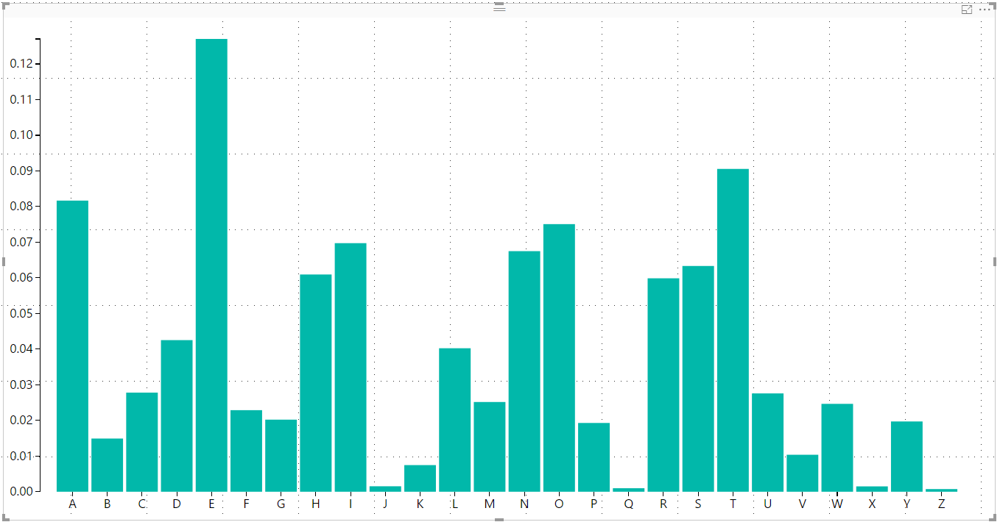

Power BI D3.js Visual



# Overview

The D3.js Visual for Power BI provides a D3.js skeleton visual that everybody can use to create custom visuals with D3.js.

See https://azurebi.jppp.org/power-bi-d3js-visual/ for usage and a sample.

# Build
It is possible to build the visual yourself.

First run
```
npm install
```

After installing 
```
node .\\node_modules\\uglify-js\\bin\\uglifyjs --self -o .\\node_modules\\uglify-js\\lib\\uglify-js.js
```


###Extra step needed for Internet Explorer: 
After all the `postinstall` command are succesfull finished, change in the generated `node_modules/codemirror/lib/codemirror.js` file on line **7242**
```
window.focus();
```
into
```
try { window.focus(); } catch (e) {}
```